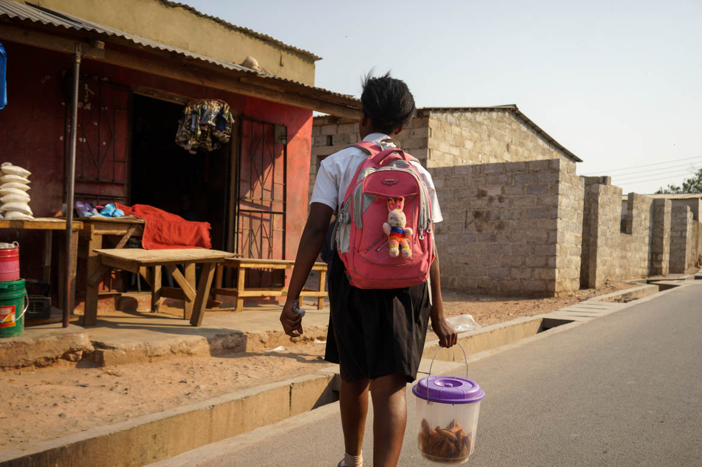
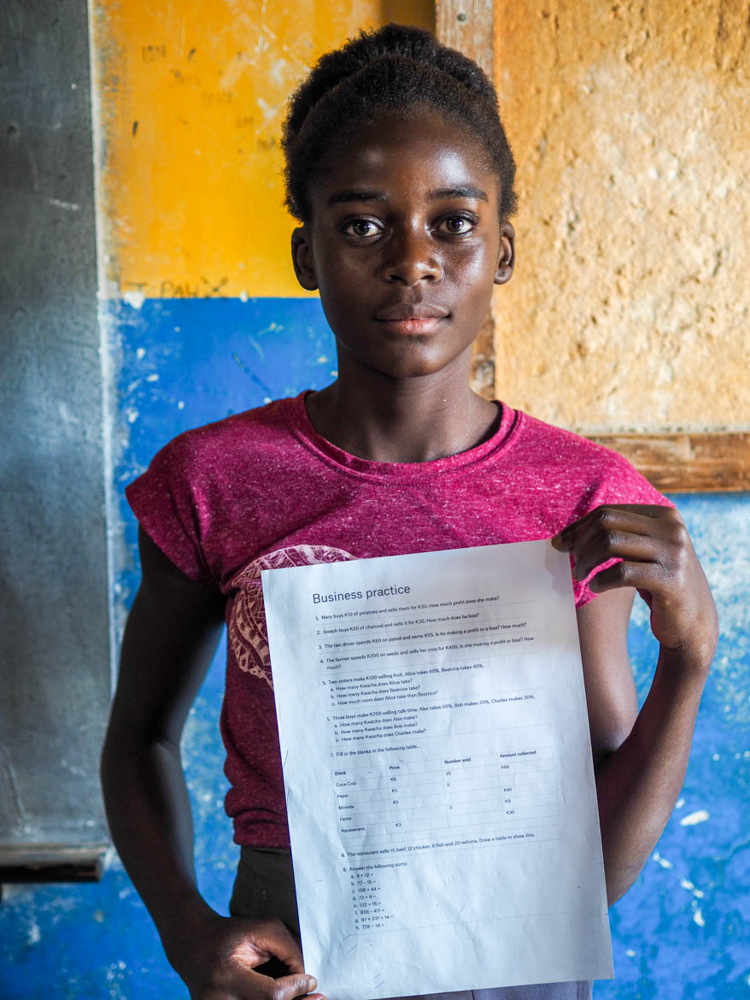
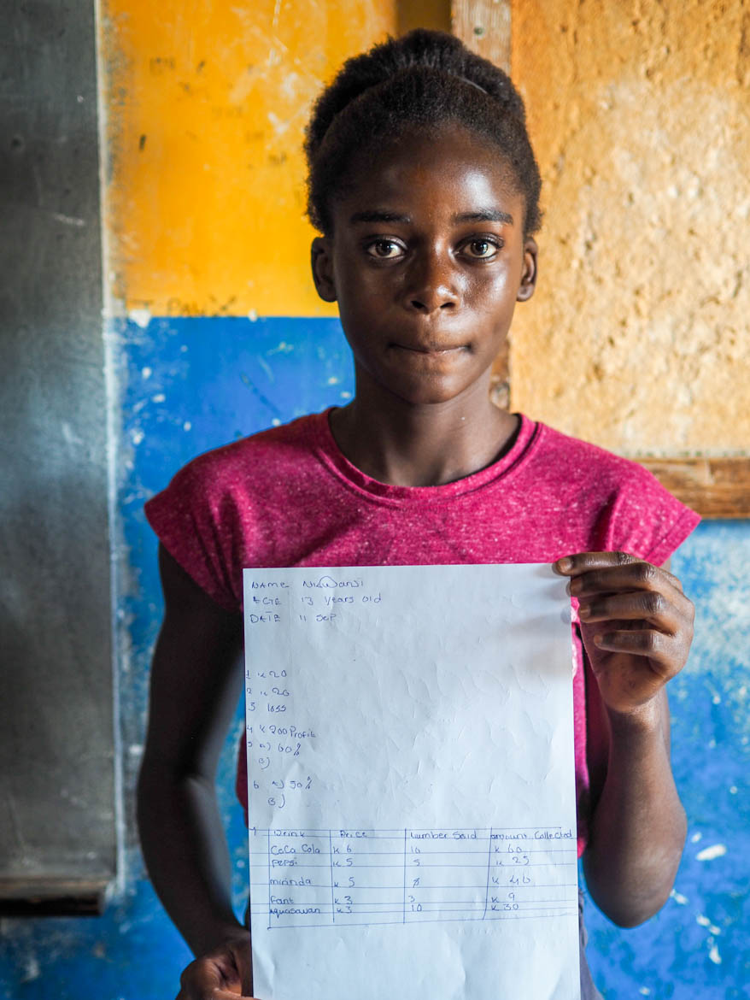
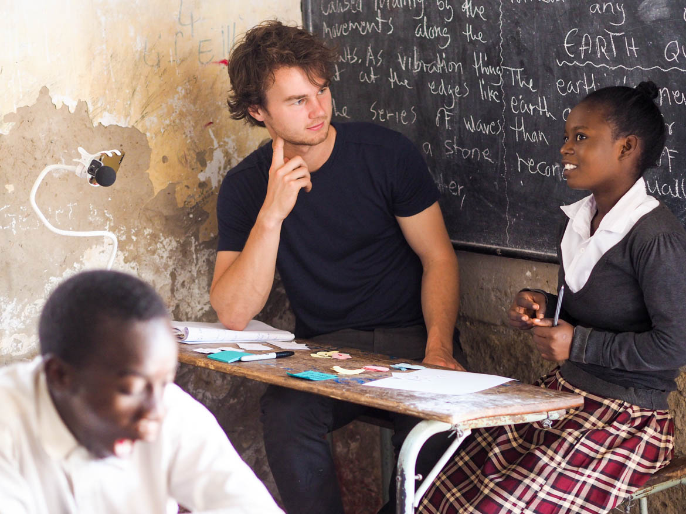
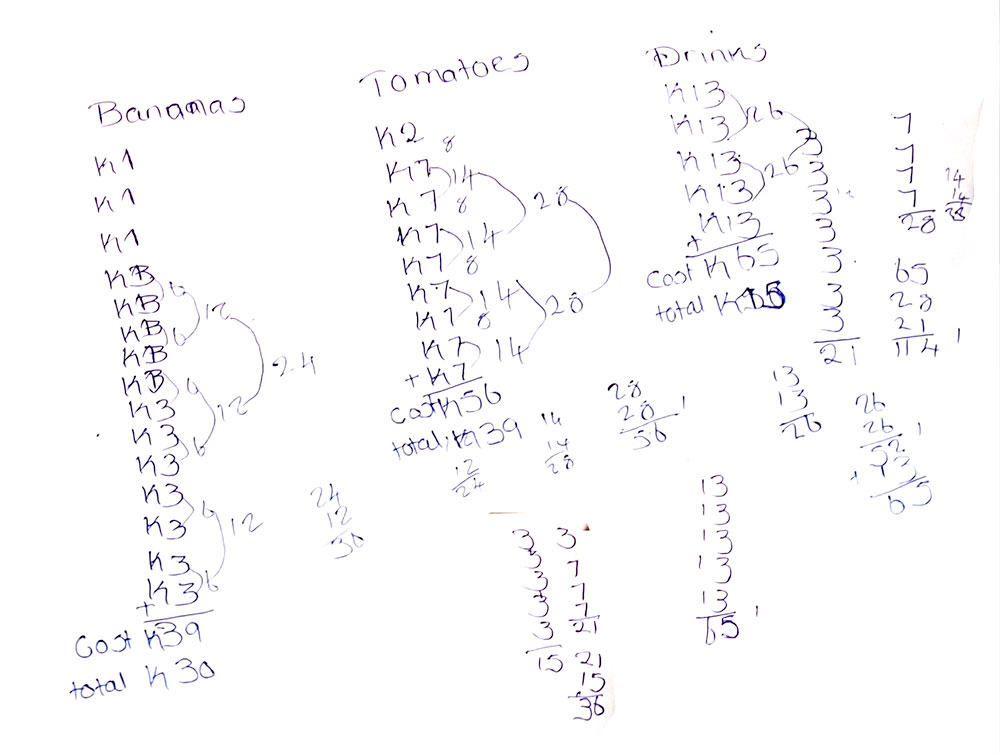
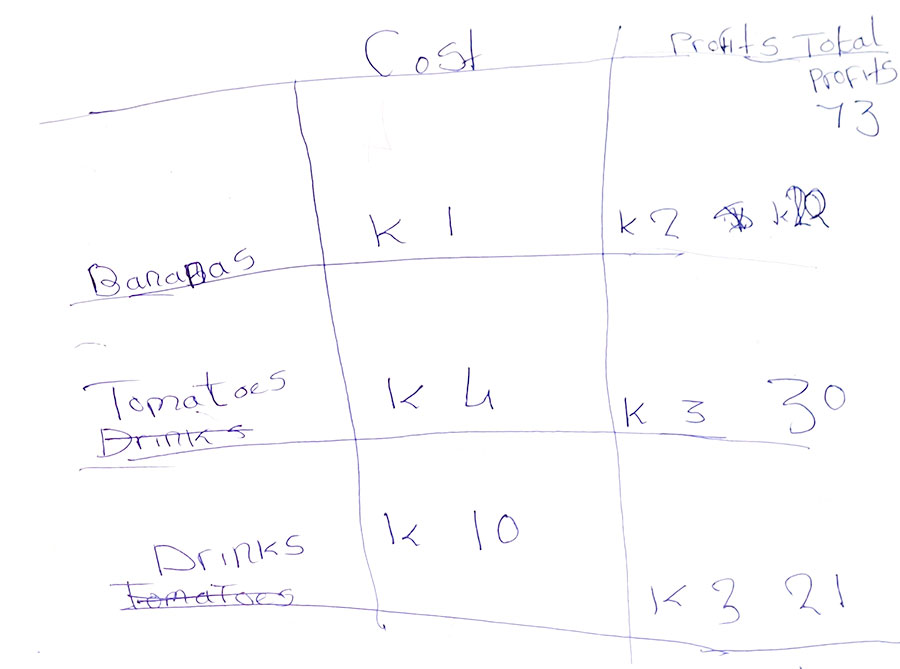
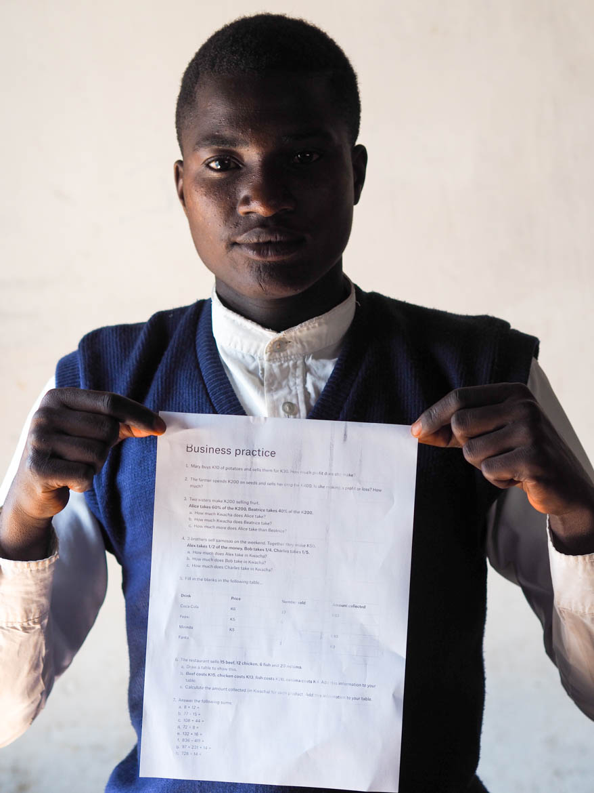
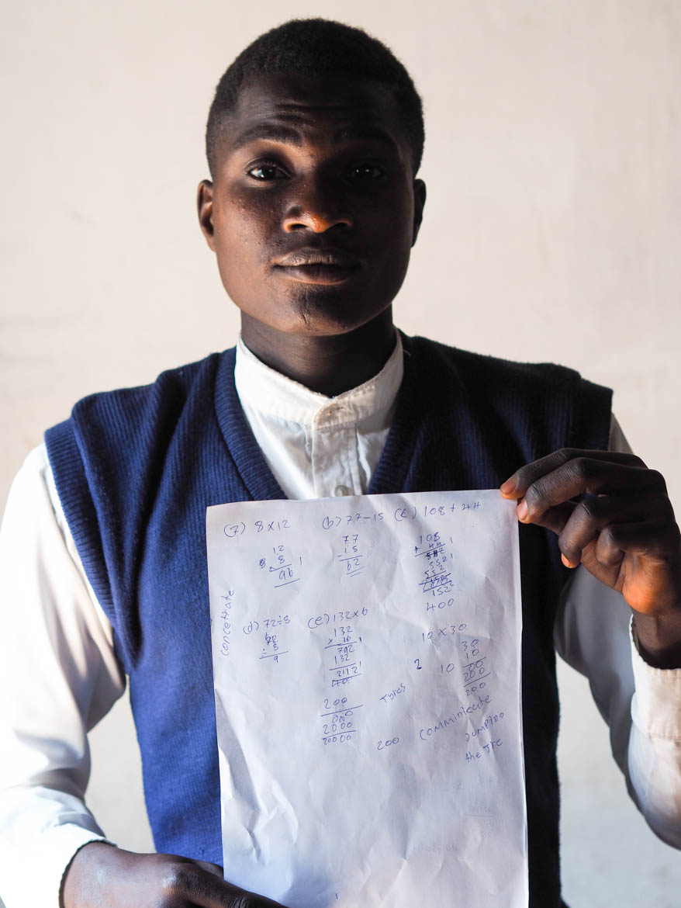

Applied Math for Enterprise is a program in development by Applied Cognitive Science. It is a project in its early stages – diagnosing and identifying students’ skill gaps. Zambia is a test case, but methods and insights will likely be applicable to other developing communities.

## Observations
Of the Zambian students we work with, roughly 2/3 have some kind of side business: selling samosas or charcoal, printing or wheelbarrow pushing, to name a few. Most exhibit few attempts to scale their businesses or increase profits. Instead, they live day to day, earning what money they can to afford food and school fees.

## Our questions: 
- If many are running such businesses, how is their grasp of functional math? 
- What skills are they missing that might help them grow their businesses?
- What skills are they missing that provide a way in to formal employment?

 <em>Student selling samosas after school, to pay for school fees. In a day's work she'll earn around $2.</em>

## General Diagnosis
We started by deconstructing applied math into its constituent component skills – making educated guesses from our observations about where students’ skill gaps might be.

With possible gaps identified, I generated a short math test, designed to cover a spectrum of skills required in basic business math. It tested concepts like profit/loss, tables, percentages and record-keeping. Questions were designed to probe each different component skill – allowing us to observe students’ proficiency with each.

### What we found:
- Despite 10 years of math classes, many students lacked basic number skills.
- Several students could not multiply two numbers together. 
- Even fewer could deal with simple percentages or division. 
- Sums were often mis-calculated, thanks to incoherent notation and inaccurate question reading.

## Business role play
Round 1’s results threw up many new questions: 
- If their calculations fail so often, what methods are they using and what’s going wrong? 
- How does their grasp of real-world money compare with their arithmetic?
- How easily can they translate between real-world and notational ‘pure’ math?

To test this, I devised a role play exercise. Students played shopkeeper with a range of products at different prices. I played customer, with money to spend. This one-to-one exercise allowed close observation of students’ methods. I was able to adjust course and investigate whenever an interesting behavior arose. I conducted this exercise with 5 students over the course of a day.

The exercise had a series of core exercises:

- I would buy things from their store. Small, simple quantities at first, gradually increasing the difficulty until they were forced to on-paper calculation.
- Adjusting prices to test trickier calculations.
- Bartering products for other products (e.g. 3 bananas for 2 drinks). Students had to decide which deals were worth taking. 
- Students drew a table to record products and track the number sold of each.
- Students had to calculate profits based on cost and retail price for each product.

What we found:
- All the students relied on long-winded addition to figure out even simple transactions. Simple multiplication was non-existent.
- Some recalled learning multiplication tables in primary school. In each case, they'd never used them since and thus forgotten.
- Most students had a good sense of which bartering deals were worth it, and which weren’t. 
- All could articulate the concept of one offer being worth more/less than another.
- The concept of multiplying a price by the quantity sold was totally absent. Students would add, add, add until they arrived at a correct price.
- Inaccurate notation would lead to huge sequences of errors. Students were often undone by their own handwriting.

<h3>Addition for everything</h3>
When solving problems with even the simplest multiplication, students would resort to adding numbers together. Often they'd tie themselves in knots with the complexity of their workings.

<h3>Trouble calculating profit</h3>
All struggled calculating totals within a table.

## Modified general test
The following day, I re-ran a modified version of the first test – adapted to cover simple fractions and drawing of tables.

    
    

### What we found
- Few could make sense of simple fractions. Many failed to find 1/2 of 100.
- Most could handle drawing a table and populating with price, number sold, revenue etc. . This suggests the prior table problems might have been a communication error.

# Overall results
This dive into math proved an eye-opening example of the failures in the education these students are receiving. The same 16 year old students who spend class time copying quadratic equations, failed at the simplest of number challenges. Most failed to find 50% of 50, divide simple numbers, or do easy/profit loss calculations.

All this suggests that their informal business is being done with very little grasp of the numbers behind it. This begs the question, how will they build savings, increase margins or grow the business?

## What next?

Next steps are to assemble a first prototype of an applied math program. We'll systematically introduce components of business math apply them to real-world scenarios. As always, students’ uptake and resulting change in skill will be recorded closely.

As we take this further, we hope to record how a better grasp of numbers can have a positive impact on their lives. Could it help them grow their businesses? Might it open doors to better jobs that could lift them out of poverty?