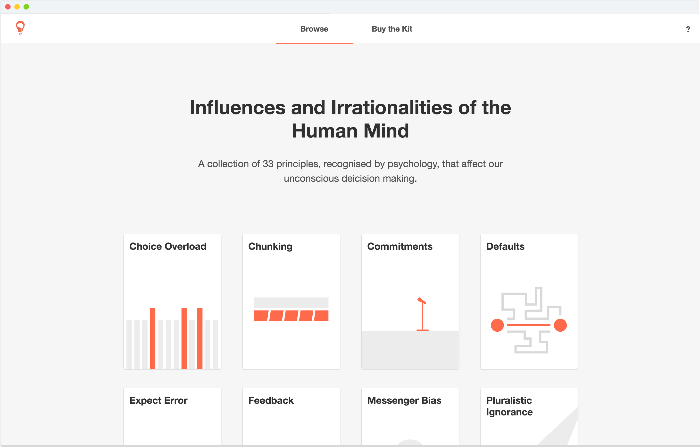

95% of our decisions happen without conscious awareness – split-second, impulsive and easily influenced.

*Thinking Inside a Box* puts scientific understanding of these influences into the hands of designer and decision makers. It's an idea-generation tool; use it to change the behaviour of your customers, users, audience, friends, parents or children.

## An online libary of human influences

To accompany the toolkit, there's an online library of the principles behind each card in Thinking Inside a Box.

See it (in progress) [**here.**](http://samstephenson.com/action-cards)