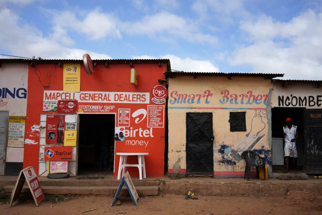

After 6 weeks of training and practice in Laos, I was tasked to launch a directed search of the opportunity space in Africa. I set off alone in June 2017 on an explorative mission to Lusaka, Zambia. After successfully trialling a reading & writing program in Laos, we were looking to make a first move into Africa – to learn about the needs of people there, and to stress-test our existing programmes in a radically different culture.

We set out with 3 big questions:

- What are the prospects and opportunities for children in urban Zambia?
- What skills could we equip them with that would have the largest impact on their futures?
- How conducive an environment is this for developing and implementing our programmes?

# Initial exploration

On day 1, I attended an event put on by a local non-profit. I interviewed many of the attendees, and made connections with several non-profits who later provided valuable introductions to schools and interesting people. Following this, first days were spent getting a lay of the land. Walking town, scouting out schools, following up connections made and conducting interviews to understand the macro-economic situation.

    
<small>Exploration</small>

    
<small>Conducting interviews</small>

    
<small>Visiting schools and observing classes</small>

Through connections with other non-profits, I was able to be guided around the lower-income ‘compounds’, visiting homes and local businesses getting an insight into the lives of ordinary people. These non-profits also allowed access to schools early on. With this, I could interview directors and spend time in classrooms – observing teaching methods and running class-wide diagnostics. Such exercises revealed information on students’ economic situations and aspirations, and surfaced useful indicators of writing and reasoning ability.

# Focusing

About 1 week in, I’d learnt enough to know what schools might be viable, and have some ideas about where we might be most effective. The majority of Lusaka’s low-income families live in the compounds: densely packed shanty towns scattered around the city outskirts. Most of these cannot afford government secondary schools. Instead they send their children to community schools: private, community-run schools, funded largely by donors and outside aid. As well as being worthy places to invest time, these were much more receptive to my presence, welcoming outside help.

    
    

I narrowed my focus to a single area, Ng’ombe compound. A shanty town on the North side of Lusaka. Its constituents represent the lower income majority of Lusaka, a demographic most in need of better education. Its large quantity of community schools also gave easy, welcome access to classrooms – maximising productive time spent running experiments.

With a shortlist of candidate schools, I could spend more time in classrooms, doing more directed observation and conducting classes to probe students’ skill levels, in areas like business, literacy, reading and speaking.

    

        <strong>Business ideas workshops</strong><small>Generating business ideas from your family's problems. Presenting them to the class.</small>
    

    

        
        <strong>Computer lessons</strong><small>Gauging students' computer literacy.</small>
    

    

        
        <strong>Writing exercises</strong><small>Understanding students skill at expressing their ideas and communicating in written English.</small>
    

## Testing our existing programmes

Over the following two weeks, my focus increasingly narrowed on two schools: Ng’ombe Open Community School and Aisha Project School. Both allowed me to work closely with a small group of students: Grade 8s, aged 14–16, in one; Grade 12s, aged 18–21, in the other. With these students, I could re-run and test many of the exercises developed in Laos.

    

        
        <strong>Reading</strong><small>Absorbing correct grammar rules and vocabulary.</small>
    

    

        
        <strong>Generative writing</strong><small>Using mindmaps to generate ideas and plans for your future.</small>
    

    

        
        <strong>Speaking with confidence</strong><small>Public speaking practice – designed to build a ritual of practicing and acting on feedback.</small>
    

    

        
        <strong>Written communication</strong><small>Letter writing proved a great way to spark a sense of care in students' writing.</small>
    

    

        
        <strong>Writing & prepositions</strong><small>Using prepositions to enrich reasoning.</small>
    

Throughout the investigation, I’d report back and discuss findings with the team. Each day was a continual process of feeding back information and adjusting course according to what we’d found. When the time came to leave, I flew back to meet the team in London, to decompress a little and figure out next steps. Two weeks later, we were on a plane back to Lusaka for a more development focused trip.
