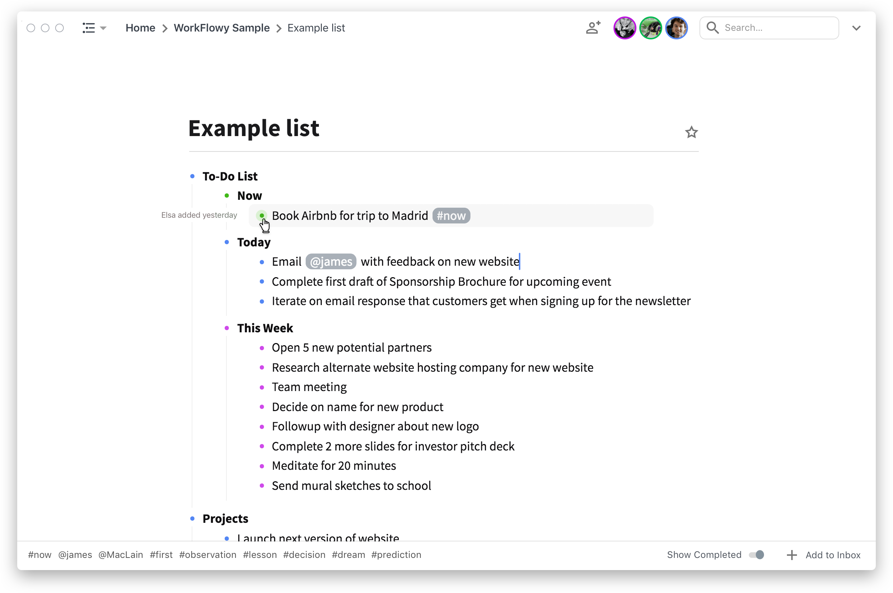

WorkFlowy is an app for writing lists, notes and outlines. It’s been around for many years now and has never received much love on the visual design front. I’ve been a daily user for over 3 years now. I love it for its structural simplicity, but have long wished for a cleaner UI to interact with.

In the past months, I’ve been building Paperback – a Chrome Extension that skins WorkFlowy with a totally redesigned UI.

# Stripping back to the essentials
Lorem ipsum dolor sit amet, consectetur adipiscing elit. Nullam quis placerat mauris, a commodo felis. Etiam auctor tempus metus, at fermentum sem laoreet sed. Suspendisse quis interdum enim. 

# Riding the line between structure and readability
Lorem ipsum dolor sit amet, consectetur adipiscing elit. Nullam quis placerat mauris, a commodo felis. Etiam auctor tempus metus, at fermentum sem laoreet sed. Suspendisse quis interdum enim. 

# A consistent system for UI elements
Lorem ipsum dolor sit amet, consectetur adipiscing elit. Nullam quis placerat mauris, a commodo felis. Etiam auctor tempus metus, at fermentum sem laoreet sed. Suspendisse quis interdum enim. 